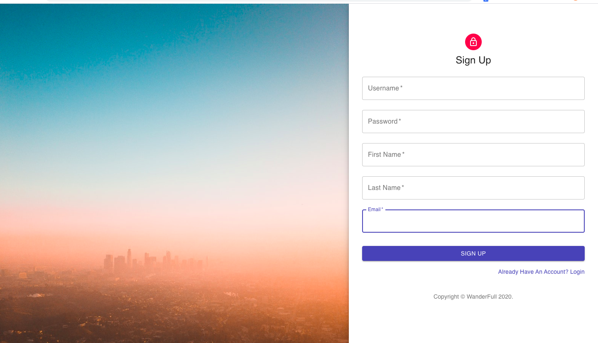
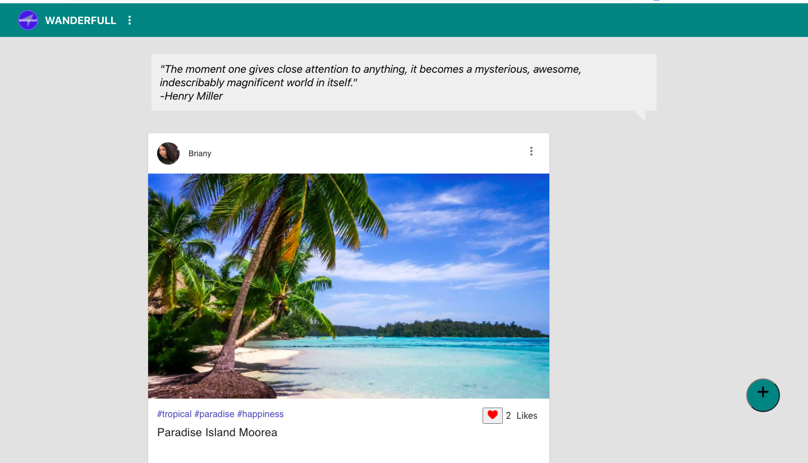

# WanderFull

A social media app that encourages users to share their endless amounts of travel photos and favorite foods. App allows users to interact with their friends on a responsive UI, where they can share/view/like posts, and search for posts by hashtag or location.

Built with React.js, Node.js with Express, PostgreSQL, and Material UI.

